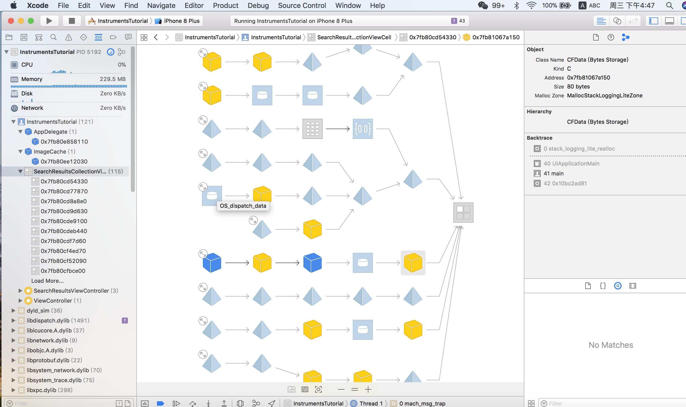
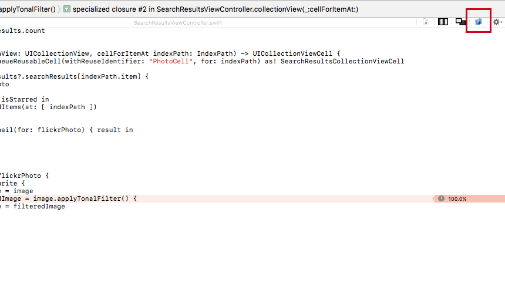

# Instruments_go
学习 iOS 的 instruments

# ⌘I

<h2>  学习资料 </h2>

<ul>
<li>
<a href="https://www.raywenderlich.com/166125/instruments-tutorial-swift-getting-started"> Instruments Tutorial with Swift: Getting Started</a>
</li>

<li>
<a href="https://videos.raywenderlich.com/courses/74-practical-instruments/lessons/3">
Practical Instruments
</a>
</li>
</ul>

<strong>Memory Inspector</strong>

<table>
<tr>
<th>Time for Profiling</th>
<td>
 Call Tree
</td>
<td>
Symbol Name
</td>
<td>

</td>
<td>

</td>
</tr>

<tr>
<th>Allocation</th>
<td>
 All Heap and Anonymous VM.

</td>
<td>
generation analysis
</td>
<td>
Mark Generation
</td>
</tr>

<tr>
<th>the Visual Memory Debugger</th>
<td>

Malloc Stack 
</td>
<td>

</td>
<td>

</td>
</tr>

</table>

### In this tutorial you’re going to learn:

* How to determine hot-spots in your code using the Time Profiler instrument in order to make your code more efficient, and
* How to detect and fix memory management issues such as strong reference cycles in your code using the Allocations instrument and the Visual Memory Debugger.

### Tip One: 

Scan the results to identify which rows have the highest percentage in the Weight column. Notice that the row with the Main Thread is using up a significant proportion of CPU cycles. Unfold this row by clicking the small arrow to the left of the text, and drill down until you see of one of your own methods (marked with the “person” symbol). Although some values may be slightly different, the order of the entries should be similar to the table below:

### Tip Two:

Scan the results to identify which rows have the highest percentage in the Weight column. Notice that the row with the Main Thread is using up a significant proportion of CPU cycles. Unfold this row by clicking the small arrow to the left of the text, and drill down until you see of one of your own methods (marked with the “person” symbol). Although some values may be slightly different, the order of the entries should be similar to the table below:

翻译下：在 权重 列 ，降序 排列，百分比 最高的在上面。最上面的 是主线程，unfold 展开。一级一级 往下看。

我注意到： call Tree Symbol 的 第一级 是实际的 方法里。 第二级 就是 调用 上一个方法的代理方法里了。

### Tip Three:

Now click the small arrow to the left of the applyTonalFilter row at the top of the table. This will show the caller of applyTonalFilter. You may need to unfold the next row too; when profiling Swift, there will sometimes be duplicate rows in the Call Tree, prefixed with @objc. You’re interested in the first row that’s prefixed with the “person” symbol, which indicates it belongs to your app’s target:

我们关心的 是 Call Tree 中  prefixed with the “person” symbol （就是 前面 带小人图标的）。 影响的（起作用的是）我们写的方法，可以调整的。

### Tip Four:

* Debug Information Format : DWARF with dSYM file  :

Get method names in the stack tree outputs.

* Hide System Libraries

* Invert Call Tree : See the leaves on the top (方法 倒置)

> Quick Tip, 关于展开的 方式
If you hold option ,
And then click this triangle,
It will do all the drilling for u.
(彻底 展开)

* 选择特定的 时间段分析

## 单元 测试 中的 集成测试 integration test ,可以 测试 网络

> Note: The Given-When-Then structure of a test originated with Behavior Driven Development (BDD) as a client-friendly, low-jargon nomenclature. Alternative naming systems are Arrange-Act-Assert and Assemble-Activate-Assert.

## 内存的释放机制。

NSCache, 怎么从内存中， 拉取缓存数据。

就是 第一次开启，搞了些数据。
第二次开启，拉取之前的。

> Besides :
> 要心里有用户
> 产品设计层:
> 避免一切不必要的场景
>
>
>  大学里面的: 知道停止，然后有定力
>

### git 操作：

>  git push git@dengV:dengV/Instruments_go.git
